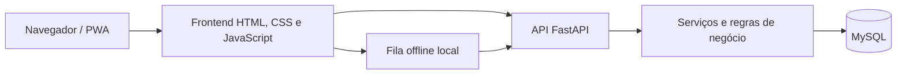

<div align="center">
  

  # Gestor de Jornadas

  Aplicação web para administração de usuários, registro de jornadas, calendário, notificações e relatórios.

  
  
  
  

  [**Acessar demonstração online**](https://origins00.github.io/sistema-gestao-jornadas/)
</div>

## Sobre o projeto

O Gestor de Jornadas é uma versão demonstrativa e genérica de um sistema criado para resolver necessidades reais de organização interna. O projeto reúne frontend, API, banco de dados e recursos de PWA em um único repositório.

Esta edição foi preparada exclusivamente para portfólio. Ela não contém cadastros, bancos preenchidos, credenciais, domínios ou informações operacionais de qualquer ambiente real.

## Demonstração online

A [demonstração interativa](https://origins00.github.io/sistema-gestao-jornadas/) funciona inteiramente no navegador, sem backend ou banco de dados. Clique em **Entrar na demonstração** para navegar pelo painel, registrar uma jornada simulada, consultar a equipe e o calendário e gerar um relatório fictício.

Os dados são apenas ilustrativos e ficam no armazenamento local do próprio navegador. A opção **Reiniciar demonstração** apaga esse estado e restaura o conteúdo inicial.

## Funcionalidades

- Autenticação com sessão protegida por cookie e CSRF;
- Solicitação e aprovação de novos usuários;
- Administração de funcionários e permissões;
- Registro de entrada, almoço, retorno e saída;
- Jornadas administrativas e operacionais;
- Sincronização de registros pendentes no PWA;
- Calendário de feriados e situações especiais;
- Notificações e histórico de alterações;
- Relatórios de jornadas e exportação para planilha;
- Layout responsivo para computador e celular.

## Tecnologias

- **Backend:** Python, FastAPI, Pydantic e Uvicorn;
- **Frontend:** HTML, CSS e JavaScript;
- **Banco de dados:** MySQL;
- **Segurança:** Argon2, cookies HttpOnly, CSRF, CSP, HSTS e limitação de requisições;
- **Aplicação instalável:** manifest, service worker e fila local para sincronização;
- **Versionamento:** Git e GitHub.

## Arquitetura



## Privacidade da versão pública

- Os scripts SQL versionados criam apenas a estrutura do banco;
- Nenhum dump, backup, relatório ou cadastro é incluído;
- Os arquivos `.env`, logs e artefatos locais são ignorados pelo Git;
- O gerador de demonstração cria nomes e identificadores sintéticos apenas no banco local;
- Domínios de exemplo usam o sufixo reservado `.example`;
- A identidade visual e as regras específicas do sistema original foram generalizadas.

## Preparação do ambiente

### Requisitos

- Windows;
- Python 3.14;
- MySQL 8;
- Git.

### 1. Ambiente Python

```powershell
py -3.14 -m venv backend\.venv
backend\.venv\Scripts\python.exe -m pip install --upgrade pip
backend\.venv\Scripts\python.exe -m pip install -r backend\requirements.txt
Copy-Item backend\.env.example backend\.env
```

Edite `backend/.env` com as credenciais do seu MySQL local. Nunca envie esse arquivo ao GitHub.

### 2. Banco de dados

Execute os arquivos de `banco-de-dados/` em ordem numérica. O primeiro script cria o banco `gestor_jornadas`; os demais aplicam a estrutura e as migrações.

### 3. Dados fictícios opcionais

Depois de preparar o banco, execute:

```powershell
backend\.venv\Scripts\python.exe backend\app\utilitarios\criar_dados_demonstracao.py
```

O comando solicita uma senha local e cria um administrador e um funcionário fictícios. Os CPFs são calculados durante a execução e não representam dados fornecidos por pessoas reais.

### 4. Executar

```powershell
scripts\abrir-sistema.cmd
```

O atalho inicia o servidor, aguarda a aplicação ficar disponível e abre o navegador. Mantenha a janela do servidor aberta enquanto estiver usando o sistema.

Acesse:

- Aplicação: `http://127.0.0.1:8000`;
- Documentação da API em desenvolvimento: `http://127.0.0.1:8000/docs`;
- Verificação de saúde: `http://127.0.0.1:8000/api/saude`.

## Testes

```powershell
backend\.venv\Scripts\python.exe -m unittest discover -s backend\tests -p "test_*.py"
```

Os testes de JavaScript podem ser executados individualmente com Node.js a partir da raiz do projeto.

## Estrutura

```text
backend/          API, modelos, serviços, rotas e testes
banco-de-dados/   Estrutura e migrações SQL sem dados pessoais
frontend/         Interface web, PWA e testes JavaScript
scripts/          Inicialização local da aplicação
```

## Autor

Desenvolvido por [Marcos Flávio Silva Santos](https://github.com/Origins00) como projeto de estudo e portfólio em Ciência da Computação.

## Aviso

Este repositório é uma demonstração educacional. Antes de utilizar o projeto em produção, revise configurações, segurança, infraestrutura, requisitos legais e políticas de tratamento de dados aplicáveis ao seu contexto.
